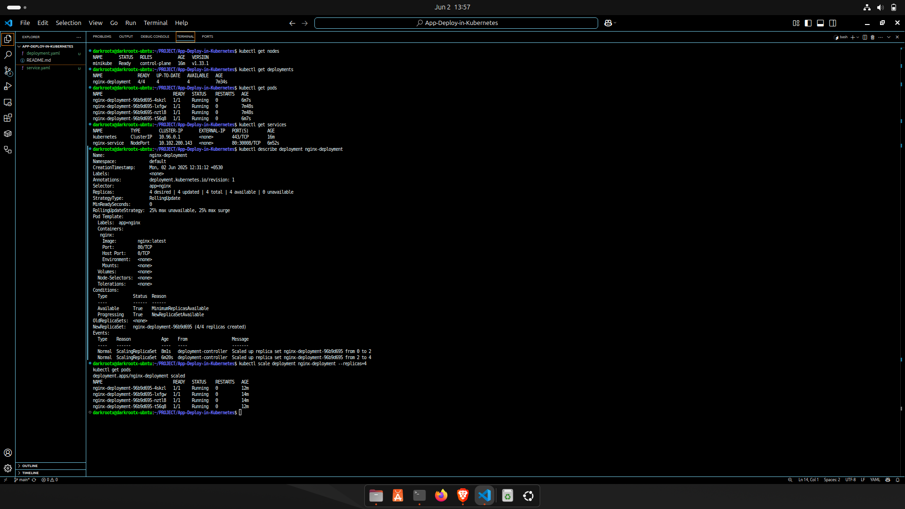

# Build a Kubernetes Cluster Locally with Minikube

## 🚀 Objective

Deploy a simple Nginx application in a Kubernetes cluster locally using Minikube. Learn how to manage Kubernetes resources like deployments and services, scale applications, and verify resource states using `kubectl`.

---

## 🛠️ Tools Used

- **Minikube**: Local Kubernetes cluster
- **kubectl**: Kubernetes command-line tool
- **Docker**: Container runtime for Minikube

---

## 📝 Steps Performed

### 1️⃣ Install Minikube and Start the Cluster

- Installed Minikube and kubectl on Ubuntu.
- Started the Minikube cluster:

  ```bash
  minikube start
  kubectl get nodes
````

---

### 2️⃣ Created Deployment (`deployment.yaml`)

```yaml
apiVersion: apps/v1
kind: Deployment
metadata:
  name: nginx-deployment
spec:
  replicas: 2
  selector:
    matchLabels:
      app: nginx
  template:
    metadata:
      labels:
        app: nginx
    spec:
      containers:
      - name: nginx
        image: nginx:latest
        ports:
        - containerPort: 80
```

* Applied the deployment:

  ```bash
  kubectl apply -f deployment.yaml
  ```

---

### 3️⃣ Exposed the App with a Service (`service.yaml`)

```yaml
apiVersion: v1
kind: Service
metadata:
  name: nginx-service
spec:
  type: NodePort
  selector:
    app: nginx
  ports:
  - protocol: TCP
    port: 80
    targetPort: 80
    nodePort: 30008
```

* Applied the service:

  ```bash
  kubectl apply -f service.yaml
  ```

---

### 4️⃣ Verified Resources

* Checked pods, deployments, and services:

  ```bash
  kubectl get pods
  kubectl get deployments
  kubectl get services
  ```

* Described resources for details:

  ```bash
  kubectl describe deployment nginx-deployment
  kubectl describe service nginx-service
  ```

---

### 5️⃣ Scaled the Deployment

* Scaled the Nginx deployment to 4 replicas:

  ```bash
  kubectl scale deployment nginx-deployment --replicas=4
  kubectl get pods
  ```

---

### 6️⃣ Checked Logs

* Fetched logs from a running Nginx pod:

  ```bash
  kubectl logs $(kubectl get pods -l app=nginx -o jsonpath="{.items[0].metadata.name}")
  ```

---

## 📸 Screenshots

## Minikube Cluster Status




---

## 💡 Kubernetes Concepts Learned

| Concept                               | Description                                                                                |
| ------------------------------------- | ------------------------------------------------------------------------------------------ |
| **Kubernetes**                        | Container orchestration platform for managing containers at scale.                         |
| **kubelet**                           | Agent running on each node to manage pods and containers.                                  |
| **Pods**                              | Smallest deployable unit in Kubernetes, wrapping one or more containers.                   |
| **Deployments**                       | Manage the desired state of pods (replicas, updates, etc.).                                |
| **Services**                          | Abstracts and exposes pods as a network service (e.g., ClusterIP, NodePort, LoadBalancer). |
| **Scaling**                           | Adjust the number of replicas in a deployment using `kubectl scale`.                       |
| **Namespaces**                        | Logical partitions for isolating Kubernetes resources.                                     |
| **ClusterIP, NodePort, LoadBalancer** | Service types for different levels of access.                                              |
| **ConfigMaps**                        | Stores non-sensitive configuration data as key-value pairs.                                |
| **Rolling Updates**                   | Gradually replaces pods during updates without downtime.                                   |

---

## 📂 Project Structure

```
.
├── deployment.yaml
├── service.yaml
├── screenshots/
│   ├── get-nodes.png
│   ├── get-pods.png
│   ├── get-deployments.png
│   ├── get-services.png
│   ├── scale-pods.png
│   └── logs.png
└── README.md
```

---

## 📚 References

* [Kubernetes Official Documentation](https://kubernetes.io/docs/home/)
* [Minikube Documentation](https://minikube.sigs.k8s.io/docs/)

---

## ✍️ Author

Debasish Mohanty

---
